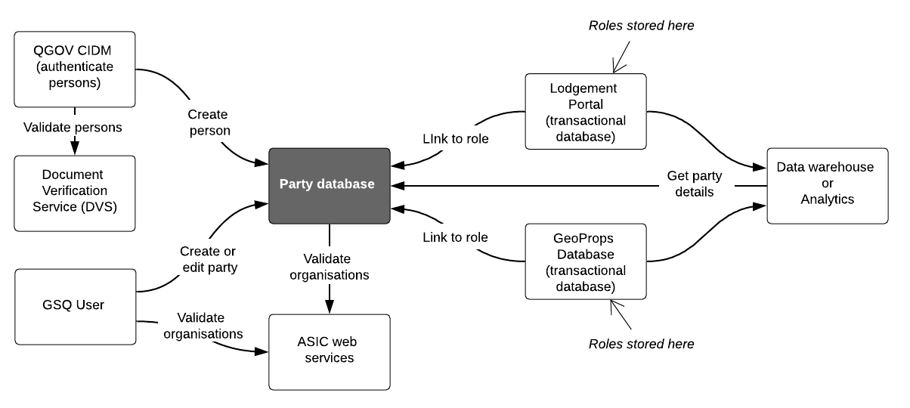

# Party Profile
The `party` profile based on the AS 4590.1:2017 Interchange of client information standard.

The `party` profile caters for natural persons and organisations.

 
Figure 1: Party conceptual data model

# Party Profile Usage
Explain the usage of the dataset profile using both textual and graphical means. This section helps the reader understand the profile and how it is used in the real world.

 
Figure 2: Party usage

## Profile Resources
This profile is presented as a series of files that perform different roles:

1. [model/](model/) - the *model* folder contains this profile's models in both graphical (SVG) and machine-readable, textual, form ( [RDF](https://www.w3.org/RDF/) turtle).
2. [shapes/](shapes/) - folder containing SHACL shapes files used to validate data's conformance to this profile's model.
3. [profile.ttl](profile.ttl) - the profile declaration. A description of all of the items in this profile (the formal model, validating resources, documentation etc.) according to the W3C's [Profiles Ontology](https://www.w3.org/TR/dx-prof/) which describes how all the parts related to one another, the roles they play (to give *guidance* for use, to *validate* data etc.) and how this profile *profiles* the various standards listed above.

## GSQ classes
> This section lists the GSQ classes that feature in the model. Use links to those classes. Delete the examples listed below as required.

Classes used in this profile:
1. TBA

## OWL classes
> This section lists the OWL classes (the internationally defined classes).  Delete the examples listed below as required.
1. TBA

## Vocabularies
> List the vocabularies and link to them if published. Delete the examples listed below as required.

The vocabularies used in this profile are:
1. TBA

## Licence
The content of this repository is licensed for use with the [Creative Commons 4.0 License](https://creativecommons.org/licenses/by/4.0/). See the [license deed](LICENSE) for details.

## Contacts
**Geoscience Information Team**,
Geological Survey of Queensland,
Department of Resources,
Brisbane, QLD, Australia,
<geological_info@resources.qld.gov.au>

